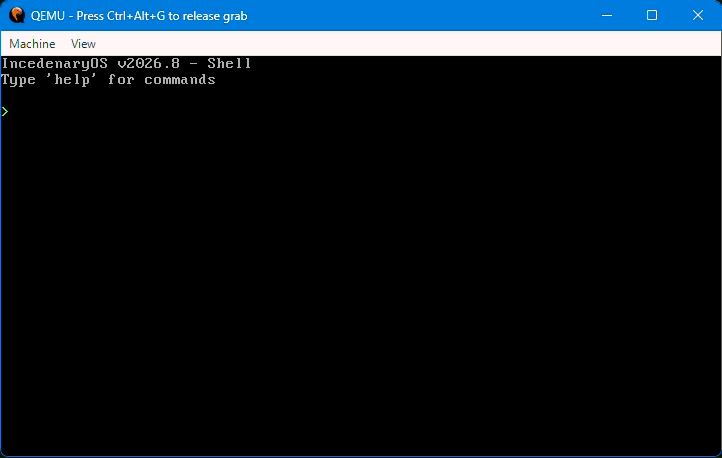

# IncedenaryOS



An OS that is made by the user lightlybyte (@lightlybyt on TikTok), it is meant to be a basic daily-driver operating system with essential drivers like PS/2, USB, HDMI, Analog Audio, and possibly other drivers in the future like DisplayPort. Made in C/C++ and NASM. Uses Batchfile and GNU Linker.

---

## ✨ Features

- ✅ Custom 32-bit kernel with Multiboot support
- ✅ VGA text mode output (80x25)
- ✅ PS/2 keyboard driver (polling-based)
- ✅ Basic shell with commands:
  - `help` — Show available commands
  - `echo` / `print` — Print text
  - `clear` — Clear the screen
  - `reboot` — Reboot the system
  - `hexdump` — Dump kernel memory
  - `ls` — List files on disk
  - `grace` — Display a special message 
- ✅ FAT12 filesystem detection (demo)
- ✅ Scrolling support
- ✅ Backspace and Enter key support in shell

---

## 🛠️ How to Build

You build by running the file:

```bash
buildkerneltoiso.bat